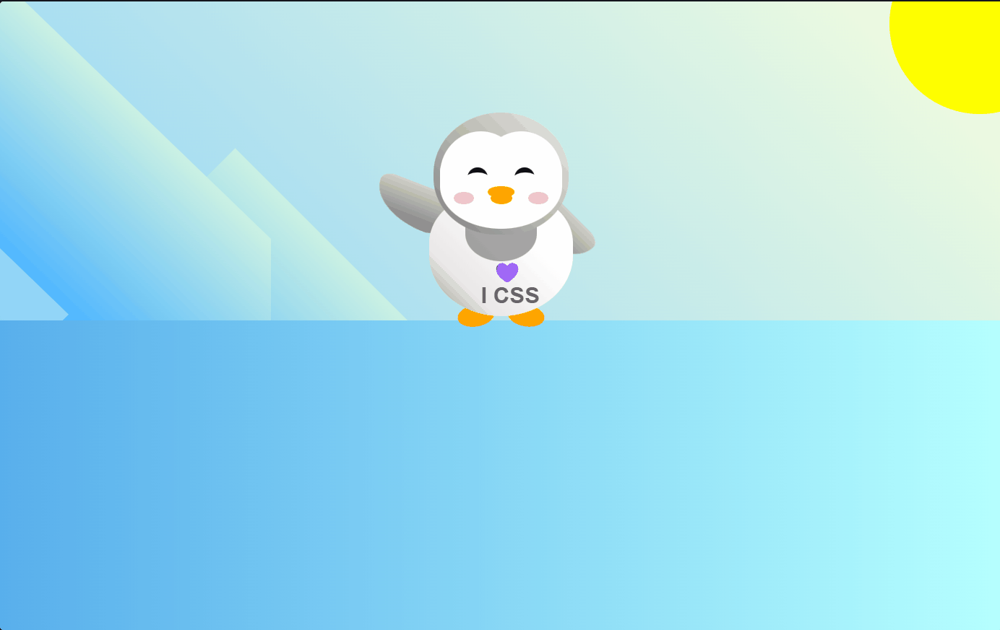

# CSS Penguin Animation

An interactive CSS art project featuring an animated penguin in a snowy landscape. Built purely with HTML and CSS using keyframe animations and transform properties.

## Preview



## Features

* **Pure CSS Art:** Rendered entirely using HTML divs and CSS gradients, shapes, and positioning.
* **Interactive Animation:** The penguin waves its arm continuously and scales up on hover/active state.
* **Responsive Layout:** Dynamic viewport sizing with absolute positioning and layered z-indexes.

## Project Structure

```text
.
├── assets/
│   └── preview.gif
├── index.html
├── styles.css
└── README.md
```

How to Run
Clone or download this repository:

Bash
git clone [https://github.com/JosueVasquez2305/Flappy-Penguin.git](https://github.com/JosueVasquez2305/Flappy-Penguin.git)
Open index.html directly in your favorite web browser.

Tech Stack
HTML5

CSS3 (Custom properties/variables, Keyframes, Flexbox, Gradients, 2D Transforms)